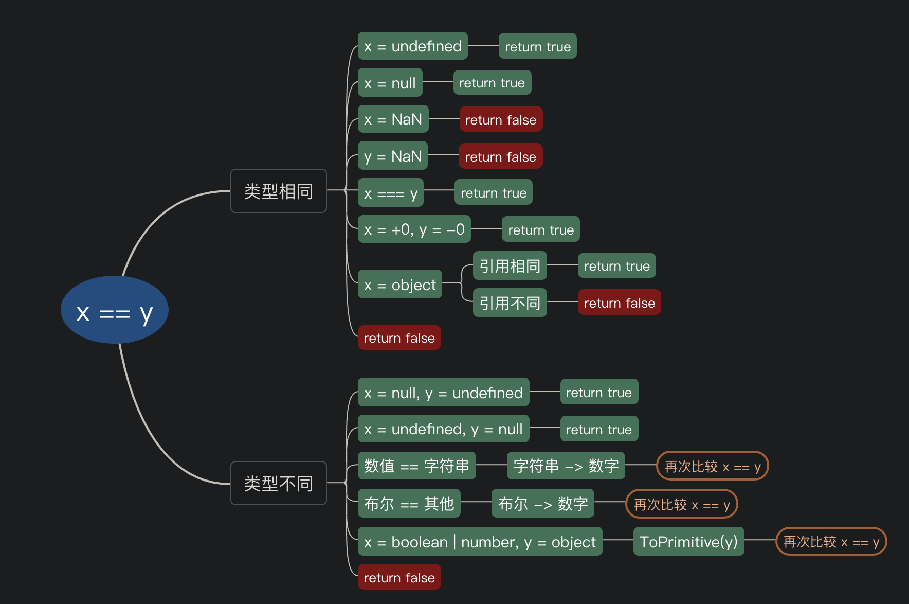

# 初学者不容错过的双等\(==\)知识点

> == 代表相同， ===代表严格相同,
>
> 进一步解释： 当进行双等号比较时候： 先检查两个操作数数据类型，如果相同， 则进行===比较， 如果不同， 则进行一次类型转换， 转换成相同类型后再进行比较， 而===比较时， 如果类型不同，直接返回false.

> 根据具体需要，JavaScript 按照如下规则将变量转换成布尔类型：
>
> 1. `false`、`0`、空字符串（`""`）、`NaN`、`null` 和 `undefined` 被转换为 `false`
> 2. 所有其他值被转换为 `true`

上述两段话大家应该都知道，被问到也都能答上来。

> 问：1 == true 返回什么？
>
> 答：true
>
> 问：2 == true 返回什么？
>
> 答：false

你的脑子里可能会想， 2转成`boolean`不是`true`么？但是，实际上，当`boolean`与`number`做双等判断时，是将`true`转成1再与数字做比较

> 如果你不知道这个，那就浪费5分钟看一下下文吧～

### 三等===:

1. 如果类型不同，就一定不相等
2. 如果两个都是数值，并且是同一个值，那么相等；如果其中**至少一个是NaN**，那么不相等。（判断一个值是否是NaN，只能使用isNaN\( \) 来判断）
3. 如果两个都是字符串，每个位置的字符都一样，那么相等，否则不相等。
4. 如果两个值都是true，或是false，那么相等
5. 如果两个值都引用同一个对象或是函数，那么相等，否则不相等
6. 如果两个值都是null，或是undefined，那么相等

> 记笔记：
>
> `NaN === NaN  // false`
>
> `+0 === -0 // true`
>
> 等式 `(x !== x)` 成立的唯一情况是 x 的值为 NaN）


### 双等==：

1. 优先对比数据的类型是否一致
2. 如果两个值类型相同，则进行三等\(===\)比较
3. 不一致则**进行隐式转换，**然后进行三等\(===\)比较

> 在比较前将两个被比较的值转换为相同类型。在转换后（等式的一边或两边都可能被转换）
>
> 如果无法转成同类型就报错

ECMAS实现双等的抽象比较的逻辑如下：

`x == y`

1. x 与 y 类型**相同**

   a. Type\(x\) 为 undefined，返回true

   b. Type\(x\) 为 null，返回true

   c. Type\(x\) 为 number，则

       i. x 为NaN，返回false 

       ii. y 为NaN，返回false 

       iii. x 与 y的值相等，返回 true

       iv. x = +0, y = - 0, 返回true

       v. 返回 false

   d. 如果 Type\(x\) 为 string, y 为与 x 一致的字符串，返回 true， 否则返回 false

   e. Type\(x\) 为 number，判断是否都是true或者false

   f. Type\(x\) 为对象， x 和 y 指向同一对象时返回true，否则返回 false

2.  x 为 null，y 为 undefined， 返回 true
3. x 为 undefined，y 为 null， 返回 true
4. 数字 == 字符串，string 转成number
5.  boolean == any, boolean 转成 number， 然后重新进行双等比较
6. 字符串 == 对象 或 数字 == 对象， 调用 ToPrimitive\(object\) 转成 string 或 number
7. 返回 false

> `ToPrimitive(A)`通过尝试调用 A 的`A.toString()` 和 `A.valueOf()` 方法，将参数 A 转换为原始值（Primitive）。

> `ToNumber(A)` 尝试在比较前将参数 A 转换为数字，这与 +A（单目运算符+）的效果相同。

上图说话，按从上到下的逻辑执行：



相等操作符对于不同类型的值，进行的比较如下图所示：

|  | 被比较值 B |  |  |  |  |  |  |
| :--- | :--- | :--- | :--- | :--- | :--- | :--- | :--- |
|  |  | Undefined | Null | Number | String | Boolean | Object |
| 被比较值 A | Undefined | `true` | `true` | `false` | `false` | `false` | `IsFalsy(B)` |
| Null | `true` | `true` | `false` | `false` | `false` | `IsFalsy(B)` |  |
| Number | `false` | `false` | `A === B` | `A === ToNumber(B)` | `A=== ToNumber(B)` | `A== ToPrimitive(B)` |  |
| String | `false` | `false` | `ToNumber(A) === B` | `A === B` | `ToNumber(A) === ToNumber(B)` | `ToPrimitive(B) == A` |  |
| Boolean | `false` | `false` | `ToNumber(A) === B` | `ToNumber(A) === ToNumber(B)` | `A === B` | ToNumber\(A\) == ToPrimitive\(B\) |  |
| Object | false | false | `ToPrimitive(A) == B` | `ToPrimitive(A) == B` | ToPrimitive\(A\) == ToNumber\(B\) | `A === B` |  |

例子

```javascript
var num = 0;
var obj = new String("0");
var str = "0";
var b = false;

console.log(num == num); // true
console.log(obj == obj); // true
console.log(str == str); // true

console.log(num == obj); // true
console.log(num == str); // true
console.log(obj == str); // true
console.log(null == undefined); // true

// both false, except in rare cases
console.log(obj == null);
console.log(obj == undefined);
```

有些开发者认为，最好永远都不要使用相等操作符。全等操作符的结果更容易预测，并且因为没有隐式转换，全等比较的操作会更快。

如果你收获了新的知识，请给作者点个赞吧～


> 参考文档
>
> [JavaScript 中的相等性判断](https://developer.mozilla.org/zh-CN/docs/Web/JavaScript/Equality_comparisons_and_sameness)

  


