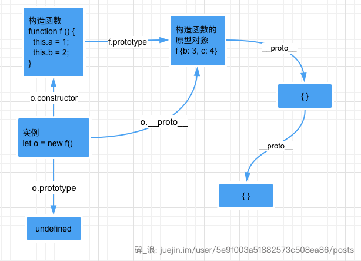

# 继承与原型链

JavaScript 是动态的，并且本身不提供一个 `class` 实现。（在 ES2015/ES6 中引入了 `class` 关键字，但那只是语法糖，JavaScript 仍然是基于原型的）。

### 只有对象类型才有继承与原型概念

> 不断向上追溯的原型共同组成了原型链

* 每个实例对象（ object ）都有一个私有属性（称之为 \_\_proto\_\_ ）指向它的构造函数的原型对象（**prototype** ）。
* 该原型对象也有一个自己的原型对象\( \_\_proto\_\_ \) ，层层向上直到一个对象的原型对象为 `null`。
* 根据定义，`null` 没有原型，并作为这个**原型链**中的最后一个环节。
* 几乎所有 JavaScript 中的对象都是位于原型链顶端的 [`Object`](https://developer.mozilla.org/zh-CN/docs/Web/JavaScript/Reference/Global_Objects/Object) 的实例。

上面的解释可能有些绕，看完下面应该就会清晰一些。

### 基于原型链的继承 

#### 继承属性 

JavaScript 对象是动态的属性“包”（指其自己的属性）。JavaScript 对象有一个指向一个原型对象的链。当试图访问一个对象的属性时，它不仅仅在该对象上搜寻，还会搜寻该对象的原型，以及该对象的原型的原型，依次层层向上搜索，直到找到一个名字匹配的属性或到达原型链的末尾。

这里演示当尝试访问属性时会发生什么：

```javascript
// 让我们从一个自身拥有属性a和b的构造函数里创建一个对象o：
let f = function () {
   this.a = 1;
   this.b = 2;
}
/* 这么写也一样
function f() {
  this.a = 1;
  this.b = 2;
}
*/

let o = new f(); // {a: 1, b: 2}

console.log(o) // f { a: 1, b: 2 }

// 指向构造函数
console.log(o.constructor) 
// function () {
//  this.a = 1;
//  this.b = 2;
// } 

// 实例没有原型对象
console.log(o.prototype) // undefined

//构造函数的原型对象
console.log(o.constructor.prototype, f.prototype)  f {} f {}

// 实例的__proto__指向构造函数的原型对象
console.log('o.proto', o.__proto__, typeof o.__proto__) // f {} object


```

综上，整个原型链如下: 


现在，下面四条就很清晰明确了

* 每个实例对象（ object ）都有一个私有属性（称之为 \_\_proto\_\_ ）指向它的构造函数的原型对象（**prototype** ）。
* 该原型对象也有一个自己的原型对象\( \_\_proto\_\_ \) ，层层向上直到一个对象的原型对象为 `null`。
* 根据定义，`null` 没有原型，并作为这个**原型链**中的最后一个环节。
* 不断向上追溯的原型共同组成了原型链

> * 对象的原型为`__proto__`属性
> * 函数有2个属性，一个是是`__proto__`，还有一个是函数专有的`prototype`属性，因为函数有双重身份，即可以是实例也可以是构造器
> * `Object.prototype` 为 `{}`
> * 箭头函数虽然属于函数，由Function产生，但是没有prototype属性没有构造器特性，所以也就没有所谓的constructor，不能作为构造器使用

下面对构造函数的原型做些变更

```javascript
// 在f函数的原型上定义属性
f.prototype.b = 3;
f.prototype.c = 4;
```

> 不要在 f 函数的原型上直接定义对象， f.prototype = {b:3,c:4}; 这样会直接打破原型链

```javascript
// 实例的__proto__指向构造函数的原型对象
console.log('o.proto', o.__proto__) // f { b: 3, c: 4 }
```

变更之后的原型链如下：



```javascript
// 遵循ECMAScript标准，someObject.[[Prototype]] 符号是用于指向 someObject 的原型。

console.log(o.a); // 1
// a是o的自身属性吗？是的，该属性的值为 1

console.log(o.b); // 2
// b是o的自身属性吗？是的，该属性的值为 2
// 原型上也有一个'b'属性，但是它不会被访问到。
// 这种情况被称为"属性遮蔽 (property shadowing)"

console.log(o.c); // 4
// c是o的自身属性吗？不是，那看看它的原型上有没有
// c是o.[[Prototype]]的属性吗？是的，该属性的值为 4

console.log(o.d); // undefined
// d 是 o 的自身属性吗？不是，那看看它的原型上有没有
// d 是 o.[[Prototype]] 的属性吗？不是，那看看它的原型上有没有
// o.[[Prototype]].[[Prototype]] 为 null，停止搜索
// 找不到 d 属性，返回 undefined
```

#### 继承方法

JavaScript 并没有其他基于类的语言所定义的“方法”。在 JavaScript 里，任何函数都可以添加到对象上作为对象的属性。函数的继承与其他的属性继承没有差别，包括上面的“属性遮蔽”（这种情况相当于其他语言的方法重写）。

当继承的函数被调用时，[this](https://developer.mozilla.org/zh-CN/docs/Web/JavaScript/Reference/Operators/this) 指向的是当前继承的对象，而不是继承的函数所在的原型对象。

```javascript
var o = {
  a: 2,
  m: function(){
    return this.a + 1;
  }
};

console.log(o.m()); // 3
// 当调用 o.m 时，'this' 指向了 o.

var p = Object.create(o);
// p是一个继承自 o 的对象

p.a = 4; // 创建 p 的自身属性 'a'
console.log(p.m()); // 5
// 调用 p.m 时，'this' 指向了 p
// 又因为 p 继承了 o 的 m 函数
// 所以，此时的 'this.a' 即 p.a，就是 p 的自身属性 'a' 
```

> ECMAScript 5 中引入了一个新方法：[`Object.create()`](https://developer.mozilla.org/zh-CN/docs/Web/JavaScript/Reference/Global_Objects/Object/create)。可以调用这个方法来创建一个新对象。新对象的原型就是调用 create 方法时传入的第一个参数：


### 参考文档：

MDN:[继承与原型链](https://developer.mozilla.org/zh-CN/docs/Web/JavaScript/Inheritance_and_the_prototype_chain)

