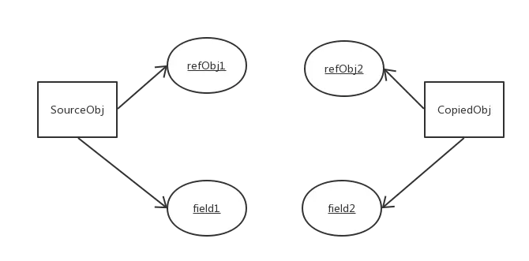

# 事件机制/

javascript是一门**单线程**语言，在最新的HTML5中提出了Web-Worker，但javascript是单线程这一核心仍未改变，不管谁写的代码，都得一句一句的来执行。

当我们打开网站时，网页的渲染过程包括了一大堆任务，比如页面元素的渲染。script脚本的执行，通过网络请求加载图片音乐之类。如果一个一个的顺序执行，遇上任务耗时过长，就会发生卡顿现象。于是，事件循环\(Event Loop\)应运而生。

### 什么是 Event Loop？

**事件循环**，可以理解为实现异步的一种方式。[event loop](https://html.spec.whatwg.org/multipage/webappapis.html#event-loop)在**HTML Standard**中的定义：

> 为了协调事件，用户交互，脚本，渲染，网络等，用户代理必须使用本节所述的`event loop`。

`JavaScript` 有一个主线程 `main thread`，和调用栈 `call-stack` 也称之为执行栈。所有的任务都会放到调用栈中等待主线程来执行。待执行的任务就是流水线上的原料，只有前一个加工完，后一个才能进行。event loops就是把原料放上流水线的工人，协调**用户交互，脚本，渲染，网络**这些不同的任务。

将待执行任务分为两类：

* 同步任务 
* 异步任务 

主线程自上而下执行所有代码

* 同步任务直接进入到主线程被执行，而异步任务则进入到 `Event Table` 并注册相对应的回调函数
* 满足指定条件\(异步任务完成\)后，`Event Table` 会将这个函数移入 `Event Queue`
* 主线程任务执行完了以后，会从`Event Queue`中读取任务，进入到主线程去执行。
* 不断重复的上述过程就是所谓的Event Loop\(事件循环\)。

### 任务队列\(task queue\)

> 一个event loop有一个或者多个task队列。当用户代理安排一个任务，必须将该任务增加到相应的event loop的一个tsak队列中。

task也被称为macrotask\(宏任务\)，是一个先进先出的队列，由指定的任务源去提供任务。

task任务源非常宽泛，总结来说task任务源包括：

* setTimeout
* setInterval
* setImmediate
* I/O
* UI rendering
* 整体代码script

所以 `Task Queue` 就是承载任务的队列。而 `JavaScript` 的 `Event Loop` 就是会不断地过来找这个 `queue`，问有没有 `task` 可以运行运行。

### 微任务\(microtask\)

> 每一个event loop都有一个microtask队列，一个microtask会被排进microtask队列而不是task队列。

microtask 队列和task 队列有些相似，都是先进先出的队列，由指定的任务源去提供任务，不同的是一个 event loop里只有一个microtask 队列。

通常认为是microtask任务源有：

* process.nextTick
* promises
* Object.observe
* MutationObserver

> [**在Promises/A+规范的Notes 3.1**](https://promisesaplus.com/#notes)**中提及了promise的then方法可以采用“宏任务（macro-task）”机制或者“微任务（micro-task）”机制来实现**。所以不同浏览器对promise的实现可能存在差异。

事件循环的顺序，决定js代码的执行顺序。进入整体代码\(宏任务\)后，开始第一次循环。接着执行所有的微任务。然后再次从宏任务开始，找到其中一个任务队列执行完毕，再执行所有的微任务。



### setTimeout

如下面代码，`setTimeout` 就是一个异步任务，

```javascript
console.log('start')
setTimeout(()=>{
  console.log('setTimeout')
});
console.log('end');
```

* 主线程执行同步任务：`console.log('start');`
* 遇到 `setTimeout` 发现是一个异步任务，就先注册了一个异步的回调
* 执行语句`console.log('end')`
* 主线程任务执行完毕，看`Event Queue`是否有待执行的 task，只要主线程的`task queue`没有任务执行了，主线程就一直在这等着
* 等异步任务等待的时间到了以后，在执行`console.log('setTimeout')`。

> js引擎存在monitoring process进程，会持续不断的检查主线程执行栈是否为空，一旦为空，就会去Event Queue那里检查是否有等待被调用的函数。

注意，只有等主线程执行完毕，才会检查`Event Queue`是否有待执行的 task，因此可能会出现另一种情况。

```javascript
console.log('start')

setTimeout(()=>{
  console.log('setTimeout')
}, 3000);

todo(); // 假定这里是一个耗时10秒的操作
```

正常情况下，控制台输出应该是这样的

```javascript
start
// 等待3秒
setTimeout
```

而实际上，输出大概是这样的：

```javascript
start
// 等待10秒
setTimeout
```

重新分析一下执行流程：

* 主线程执行同步任务：`console.log('start');`
* 遇到 `setTimeout` 发现是一个异步任务，就先注册了一个异步的回调
* 执行语句 `todo()`
* 3秒到了，计时事件`timeout`完成，打印任务进入Event Queue
* 主线程任务执行完毕，看`Event Queue`是否有待执行的 task，
* 执行`console.log('setTimeout')`。

`setTimeout`这个函数，是经过指定时间后，把要执行的任务加入到Event Queue中，与上一个栗子不同，当计时事件完成后，主线程任务并没有执行完。只有等主线程执行完本轮代码后，才会查询`Event Queue。`所以，等待大约10秒后控制台才有第二次输出。


> 参考文章：
>
> 1. \*\*\*\*[**这一次，彻底弄懂 JavaScript 执行机制**](https://juejin.im/post/59e85eebf265da430d571f89)\*\*\*\*
> 2. \*\*\*\*


