# 大数据概述与服务

## 大数据基础服务

**京东智联云大数据基础服务** 

- 数据大屏
- 数据工厂
- 数据计算服务
- JMR
- 流数据总线
- 流计算

**大数据处理流程**

数据源 --> 

- 数据采集 ：数据工厂、流数据中心 --》
- 数据存储 ：数据计算服务 --〉 
- 数据处理与分析：流计算、JMR --》
-  数据可视化：数据大屏、BI报表 --〉 
- 大数据应用

**平台技术架构**

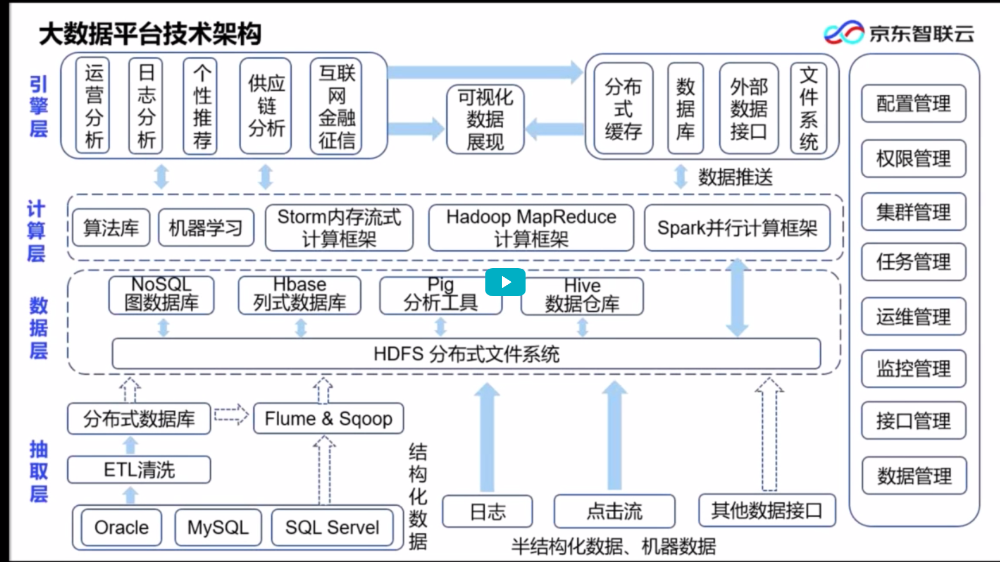

### 大数据时代

开篇：

时间线：

- 2013年，大数据元年；
- 2016年，alphaGo 大数据机器学习

彩色点：

- 软件编程：把现实世界的业务操作搬到计算机上
- 数据挖掘：发觉出用户自己都没有发现的需求
- AI编程：如何将机器学习的效果更好的呈现出来

### 大数据概述

**什么是大数据**

大数据指无法在一定时间范围内用常规软件工具进行捕捉、管理和处理的数据集合，是需要新处理模式才能具有更强的决策力、洞察发现力和流程优化能力的海量、高增长率和多样化的信息资产。

**大数据特征**

- 容量(Volume)：数据的大小决定所考虑的数据的价值和潜在的信息
- 可变性(Variability)：妨碍了处理和有效的管理数据的过程
- 种类(Variety)：数据类型的多样性
- 速度(Velocity)：指获得数据的速度
- 真实性(Veracity)：数据的质量
- 复杂性(Complexity)：数据量巨大，来源渠道多
- 价值(value)：合理运用大数据，以低成本创造高价值

业界通常用4个V来概括大数据的特征：

容量、种类、速度、价值

**大数据处理关键技术**

- 大数据采集技术
- 预处理技术
- 存储及管理技术
- 分析及挖掘技术
- 展现和应用技术（大数据检索、大数据可视化、大数据应用、大数据安全）

**大数据与传统数据比较**

| 数据量     | GB或TB           | PB级或以上   |
| ---------- | ---------------- | ------------ |
| 结构化程度 | 结构化或半结构化 | 所有类型数据 |
|数据分析需求| 现有数据的分析与检测 | 深度分析（关联分析、回归分析）|
| 硬件平台 | 高端服务器 | 集群平台 |

**应用领域**

商业智能、政府决策、公共服务

### 大数据平台

**什么是大数据平台**

整合网站应用和大数据系统之间的差异，将应用程序产生的数据导入到大数据系统，经过处理计算后再导出给应用程序使用

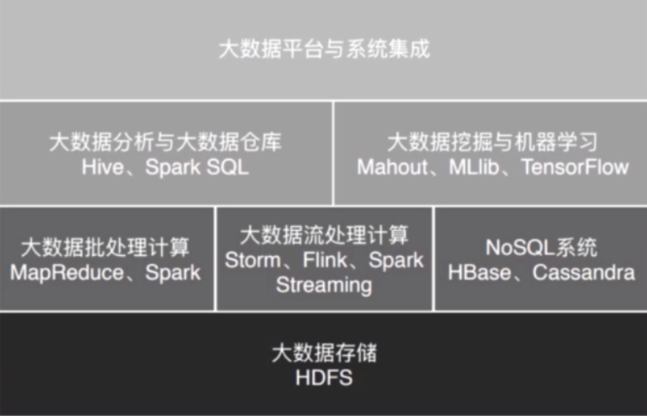

### NoSql

优势：

- 易扩展
- 灵活的数据模型
- 大数据量，高性能
- 高可用

### hadoop

开发和运行处理大规模数据的软件平台，是java实现的开源软件框架，实现在大量计算机组成的集群中对海量数据进行分布式计算。具有可靠、高效、可伸缩的特点。

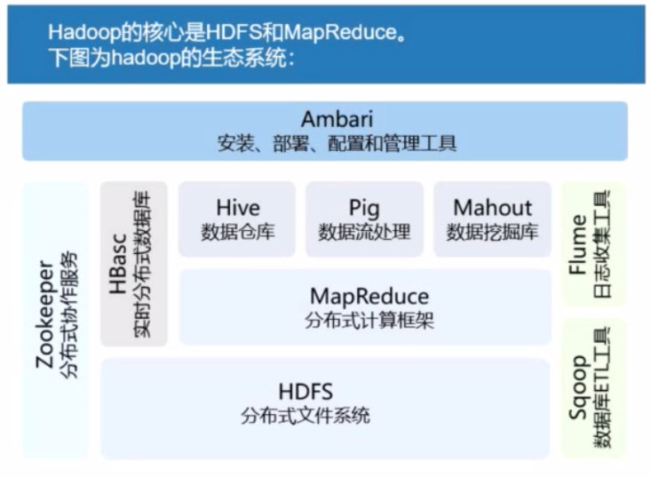

#### HIve

基于hadoop的数据仓库，最初用于解决海量结构化的日志数据统计问题。

1. 可以将结构化的数据文件应设为一张数据库表，将sql语句转换为MapReduce任务进行运行，适合数据仓库的统计分析。
2. 可以用来进行数据提取转化加载（ETL），这是一种可以存储查询和分析存储在hadoop中的大规模数据机制，完成复杂的分析工作。

**Hive数据模型**

Hive中所有数据都存储在HDFS中，数据模型主要有Database、Table、Partition、Bucket四部分

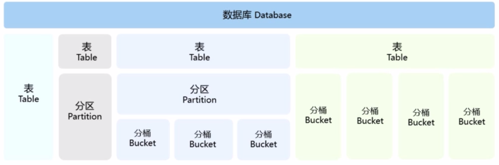

**Hive的优势**

Hive定义了一种类似sql的查询语言HQL，将sql语句转换为MapReduce任务在Hadoop上执行，通常用于离线分析。

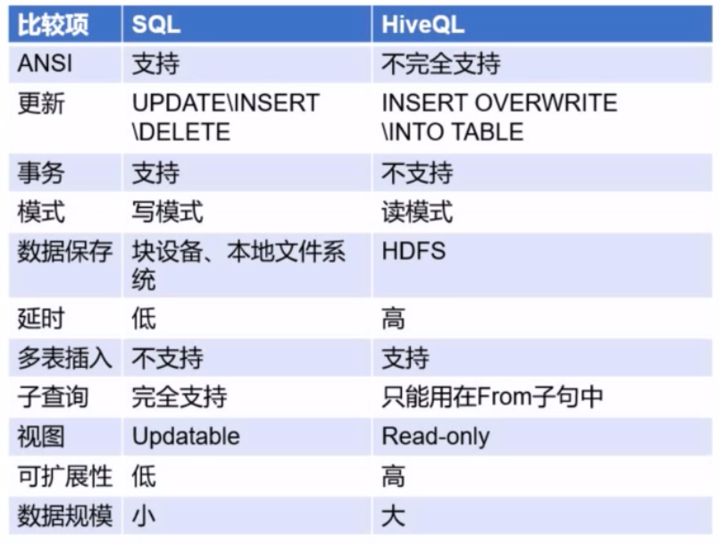

**Hive查询过程**

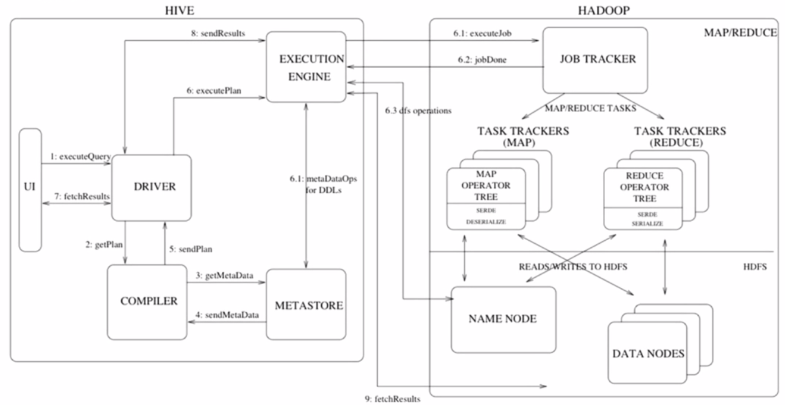

#### Spark

是一个闪电般快速的实时处理框架，它进行内存计算以实时分析数据。由于Hadoop MaoReduce仅执行批处理并且缺乏实时处理功能，因此它开始出现。它可以实时执行流处理，也可以处理批处理。

spark除了第一次载入内存之外，其他迭代时间可以忽略。

**Spark Sql 和 HIve on Spark**

Spark Sql 作为Apark生态的一员，不再受限于Hive，只是兼容Hive。将Spark作为Hive底层引擎之一，Hive将不再受限于一个引擎，可以采用Map-Reduce、Tez、Spark等引擎。

### 京东智联云CDP概述

**数据中台**

数据中台是一个数据集成平台，它不仅仅是为数据挖掘而建，更重要的功能是作为各个业务的数据源，为业务系统体术数据和计算服务。

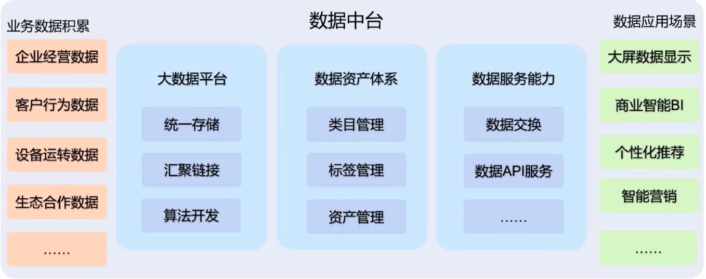

**什么是CDP**

京东智联云数据平台（CDP）基于中台构建这种服务时是考虑到可复用性的，每个服务就像一块积木，可随意组合，非常灵活，有些个性化的需求在前台解决，这就避免了重读建设，既省时，省力，又省钱。

CDP从营销领域切入客户，属于营销数据中台领域。

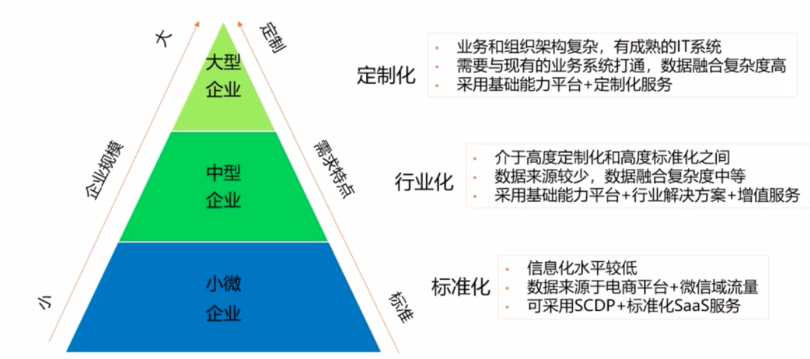

**CDP做三件事**

1. 全域数据收集
2. 顾客生命周期管理
3. 全渠道触达

### 京东智联云BDP概述

大数据基础服务产品（BDP产品）是智联云长期实践形成的大数据基础平台服务产品，具备开放的体系架构，可与主流大数据基层技术实现无缝兼容，如Spark、Hadoop等。

**京东智联云大数据基础服务产品** 

- 数据工厂
- 数据计算服务
- JMR
- 流数据总线
- 流计算

## 京东智联云CDP产品方案

### 为什么要做CDP

敏捷增长，智能决策

1. 打破信息孤岛
2. 消费者数字化
3. 重新认识顾客
4. 全渠道互动

### CDP优势

实现线上与线下，官方网站，微信矩阵，京东品牌电商间的全链路数据联合，建立品牌自主的用户信息及行为数据中台

- 京东数据赋能
- 微信链路打通
- 深入业务场景
- 多平台数据联动
- 多形式精准触达
- 线上线下结合

### CDP应用框架-品牌私域应用模型搭建

结合京东算法的营销模型搭建

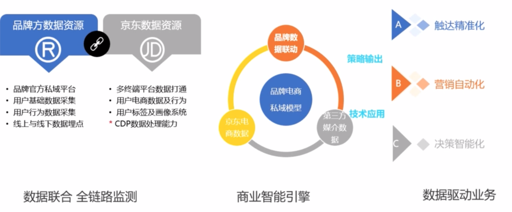

### CDP平台规划架构图：从底层云资源到上层应用的联动销售

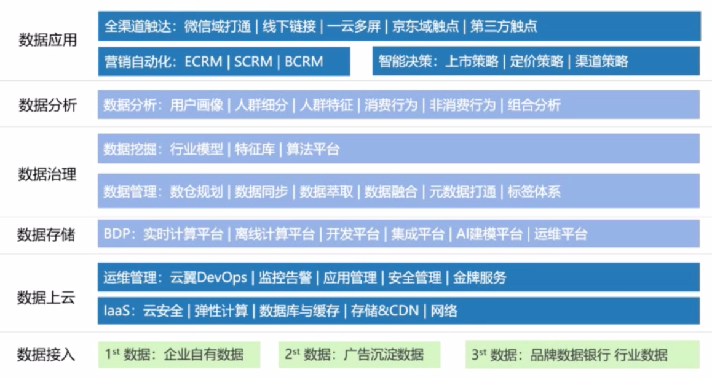

**全渠道数据收集-连接线上线下**
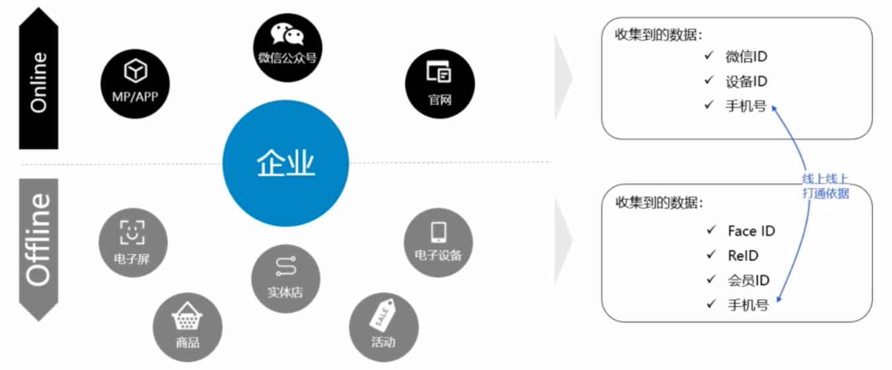

**全渠道数据收集-连接丰富的数据源，构建共享体系**
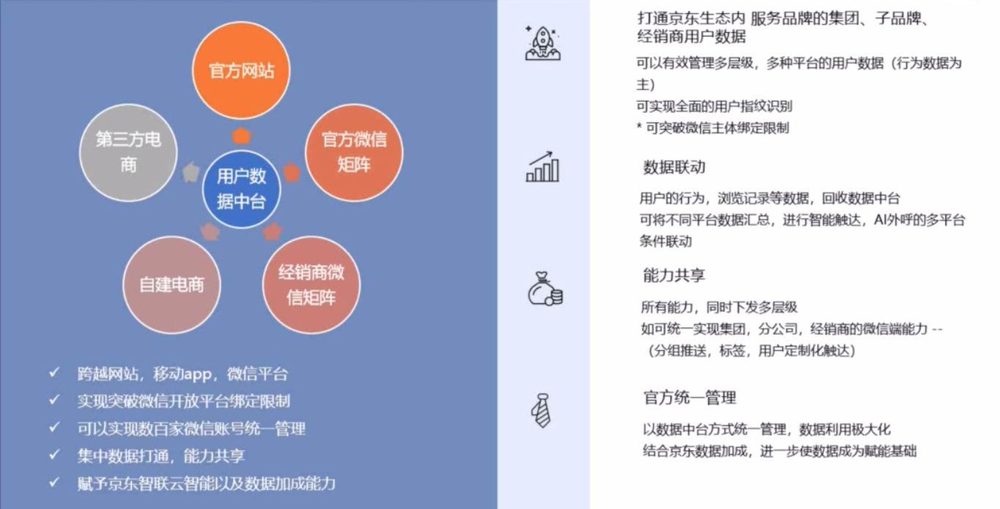

**数据打通-构建用户统一身份体系**

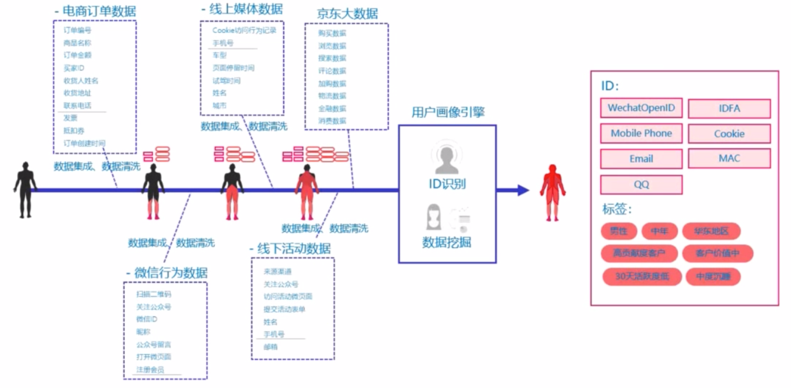

**数据管理-第一方标签体系构建**
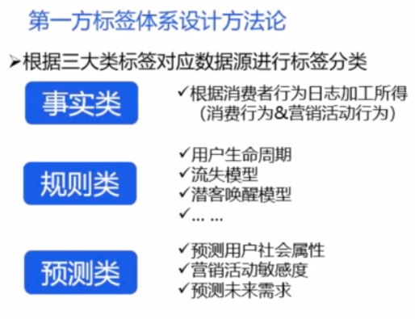

强大标签树管理能力

** 数据管理-客户分群**
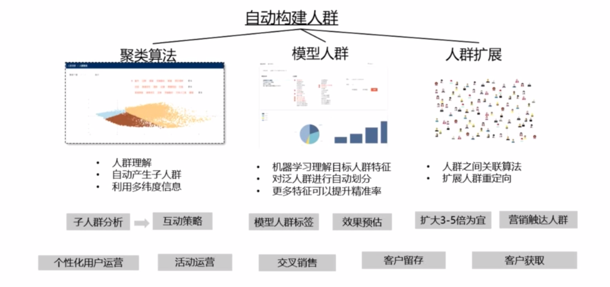

**数据管理-自动建模**
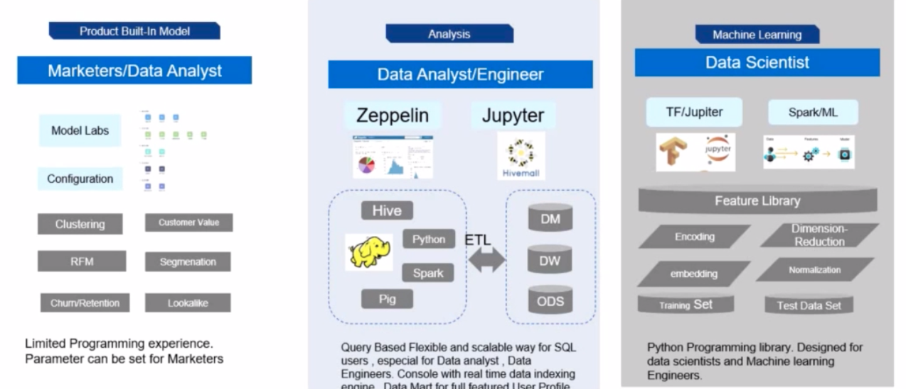

**数据管理-AI人群挖掘**
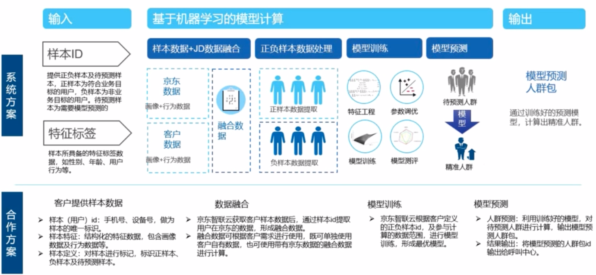

**数据挖掘-自助建模-大数据联合实验室**
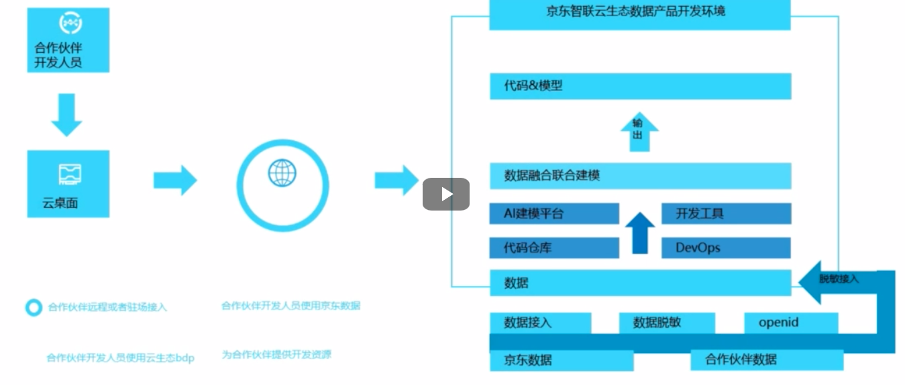

**数据挖掘-联邦学习**
客户和第三方服务商数据挖掘与京东算法工程师进行联邦建模

**数据挖掘-已经沉淀的数据资产**
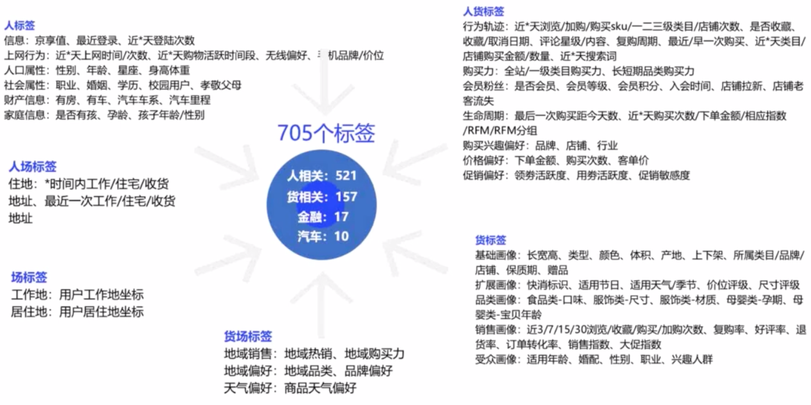

**数据分析-针对不同场景灵活分析**

- 商品
- 媒体
- 自有触点
- 会员&潜客

**数据分析-数据看版**

- 实时数据指标查看
- 跨媒体的交叉分析
- 分类别媒体指标分析

转换路径分析：找到最佳的用户转化路径
归因分析：对媒体贡献进行更客观的评估
媒体价值分析：通过价值象限多维评估媒体价值
媒体重合度分析：洞察各媒体之间的重合度

**数据分析-线上线下打通**

线上线下渠道统一管理，有效提升企业整体经营业绩
- 官网/应用分析：统一的仪表板可帮助企业网站和应用程序流量/性能
- 线下渠道分析：统一线下数据，了解离线用户的行为和趋势
- 第三方电子商务分析：与第三方EC数据集成，使企业实现一站式数据可视化和管理
- 微信/MP分析：与耐克微信粉丝和追随者的数据集成，使耐克能够在一个集中的位置监控和管理微信社交数据和策略

**数据分析-结合第三方数据的人群画像**

通过第三方数据资源，可针对客户进行多维度的用户人群画像，指导各个场景的人群施策
- App 偏好
- 常上站点
- 公众号偏好
- 出行偏好
- 线下门店品牌偏好
- 地理位置分布
- 餐饮类型偏好
- 线下娱乐场所偏好
- 节假日出游偏好

**数据分析-人群洞察**

通过人群对比，助力企业洞察人群差异
1. 人口属性对比
2. 兴趣爱好对比
3. 触媒习惯对比
4. 搜索热词对比
5. 终端占比对比
6. 地域对比

**数据分析-自定义分析**
支持业内最多60+维度的自定义的交叉报表输出，输出各种分析

**数据分析-整合品牌私域流量池的全链路追踪**

**数据分析-基于产业的消费客群洞察**

**数据应用-全域数据触达**

**数据应用-整合品牌私域流量池的全域数据触达**
针对京东智联云+品牌数据整合的，京东后链路生命周期管理
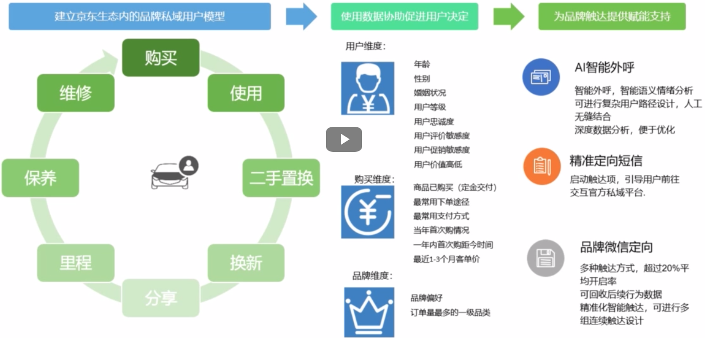

**数据应用-基于品牌拉新和复购的业务场景**

**数据应用-促活场景，AB测试对比，提升营销效果**

**数据应用-营销自动化**
全域运营：灵活自定义的营销画布，实现跨触点统一的用户沟通

**数据应用-智能反向定制 买点挖掘**
基于京东海量用户和商品数据，结合第一方数据，从用户搜索、评论和问答数据中挖掘消费者关注点，从而形成定制商品的独特卖点。

**数据应用-价格弹性，最优定价方案**

1. 模拟价格对需求的影响
2. 价格对利润的衍生影响
3. 利润最大化的最优价格

**数据应用-供应链优化**

**案例：商品智能反向定制-结合第一方数据及京东数据的新品定制**
结合奇特第一方数据和京东海量用户和商品数据
从消费者需求出发，多维度深度挖掘消费者潜在需求，以挖掘的商品卖点为约束，定制爆款
支持基于UV转化率的定制，提升新品转化
支持基于评论预测的定制，强化重要的正面评论关键词，减少负面关键词

## 京东智联云BDP架构

**京东智联云大数据基础服务产品** 

- 数据工厂：云ETL工具（数据同步+作业调度服务）
  - 不同数据源间的数据同步
  - 周期性任务调度
  - 任务监控与预警
- 数据计算服务：大数据仓库，数据分析与管理
  - 企业级数据仓库
  - 完全托管快速分析
  - 敏捷开发自定义调度
  - 灵活的权限管理
- JMR：托管 Hadoop/Spark
  - 弹性计算，快速创建集群
  - 按需计算，节约成本
- 流数据总线：大数据消息总线，订阅/发布
  - 弹性管理相应服务
  - 快速接入与集成流计算
  - 自动归档
- 流计算：流式实时计算
  - 实时数据清洗统计分析
  - 自动集成相关产品
  - 自定义作业，计算集群弹性化

### 数据工厂

**应用场景**

在数据工厂服务中可以创建同步任务来搬运数据，并按照指定的调度策略（每天、每周、每月）运行，该模块提供任务监控和告警功能，用户可以通过任务执行的明细日志和警告历史，轻松查明问题所在。同时，提供全面托管的工作流服务，支持图形化设计数据分析。以工作流任务的方式实现对数据的处理和相互依赖，帮助用户快速构建数据处理分析作业并周期性的执行。

### 数据计算服务

**应用场景**
- 构建企业数据仓库
- 低成本的海量数据清洗

### JMR

**应用场景**

JMR可应用于数据仓库、日志分析、ETL处理、临时性处理分析、即时查询分析、流式实时计算、数据对外服务等多个场景，从而为用户提供全面、实用、便捷的服务，能够有效解决企业数据来源和类型较为复杂、工作负载差异较大等问题。

### 流数据总线
**应用场景**
- 实时数据分析
- 加速的日志和数据源引入和处理

### 流计算
- 欺诈检测
- 动态定价

### 使用场景一
离线数据统计分析
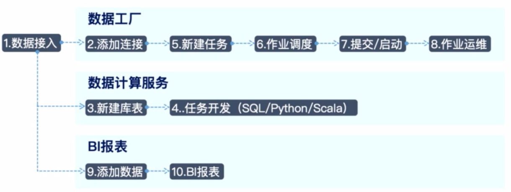

### 使用场景二
实时运营数据分析

### 案例1
数据中台
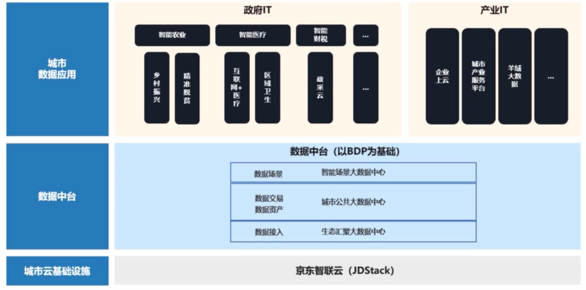

JDStack 是私有化部署方案

### 案例2
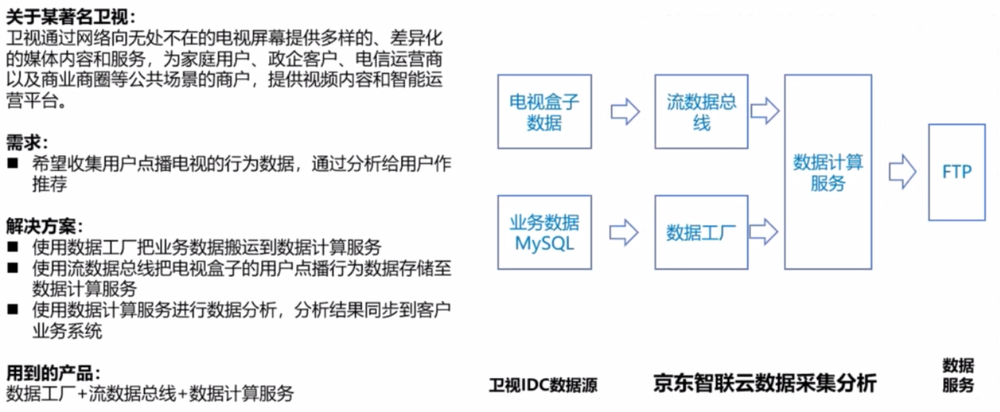

## 离线数据统计分析

### 京东智联云大数据数据产品
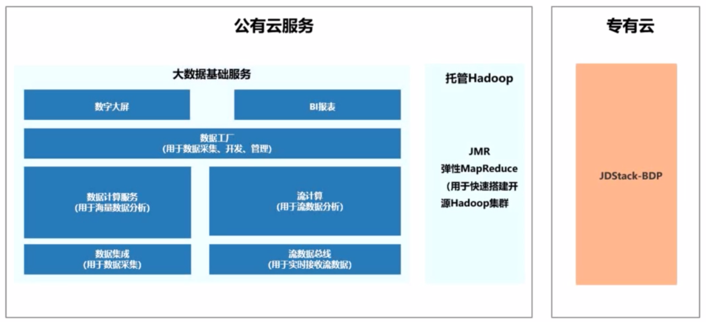

**离线数据统计分析处理流程**

数据源 --> 

- 数据采集 ：数据工厂、流数据中心 --》
- 数据存储 ：数据计算服务 --〉 
- 数据处理与分析：流计算、JMR --》
- 数据可视化：数据大屏、BI报表 --〉 
-->  大数据应用

**离线数据统计分析产品**

- BI报表
- 数据计算服务
- 数据工厂

### 1. 离线数据统计分析概念

### 2. 数据工厂
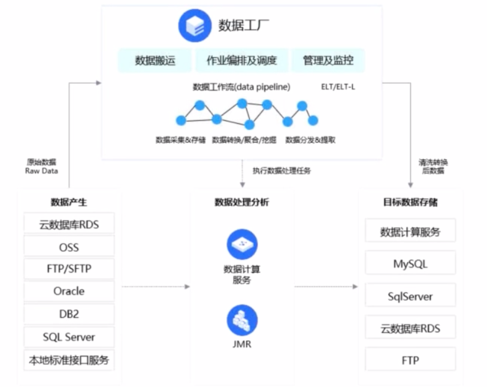

#### 数据工厂核心功能
**数据同步**
- 多数据源间的离线、批量数据同步
- 支持从多个本地和云数据源间同步数据，支持用户全量同步、增量同步等不同的同步策略

**同步任务调度管理**
- 对同步任务统一管理和调度
- 通过统一的同步任务管理，可以天、小时等不同时间维度定制调度策略

**监控和警告**
- 对同步任务设置监控告警规则
- 数据集成针对不同重要等级的同步任务可设置多种告警策略，第一时间获知同步任务的运行状态。支持用户查看完整的执行日志，对同步任务进行详细的记录

#### 数据工厂的术语定义

- **数据集**： 指由同步任务时需指定的数据源端或数据目标端的不同数据存储实例。同一个数据集，可以是多个同步任务的数据源端或数据目标端。
- **数据集连通性**：在用户创建数据集连接时，为检验数据集成服务能否连接成功，需用户根据不同的数据集类型，填入相应的值用于连通性校验。
- **同步任务**：用户使用数据工厂服务的最小单元。每一个同步任务需要用户配置数据源端、数据目标端及相应的同步策略。
- **工作流**：工作流以图形化设计任务的方式实现对数据的处理和相互依赖。

#### 链接管理
本地文件接入 
配置MYSQL数据源
配置OSS
配置FTP数据源

####数据同步
连接管理：目前支持
数据源端：云数据库、云存储、mysql、sqlserver、oracle、ftp、db2、数据计算服务
数据目标端：mysql、sqlserver、ftp、rds

**同步任务运维**

**工作流**
前置条件：确保在“数据计算服务-数据仓库”中创建数据表并上传数据，工作流运行结果输出到数据仓库，因此还需创建结果表。

### 数据计算服务
是一个全托管、低成本的云上数据仓库服务。
数据计算服务提供开箱即用的数据管理、灵活弹性的计算资源，开放的数据接口、细粒度的权限体系。帮助用户快速构建企业级数据分析平台，并持续聚焦在释放数据价值的工作。

- 海量计算：提供即时查询/批量离线处理计算能力，提供SQL/PySpark等计算能力。满足海量数据ETL以及交互式查询需求
- 任务开发：提供任务开发、自定义函数、任务调度功能，支持开发人员通过WEB/IDE/CLT/SDK进行任务开发
- 权限管理：对数据存储和访问制定安全机制，对数据操作权限具备多维权限校验机制。

工作流程图
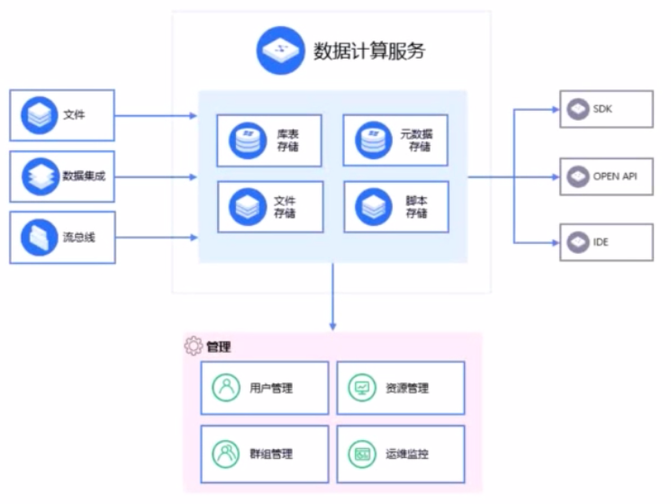

**数据加载**
UDF函数

### BI报表

一站式数据分析平台

**报表概述**
- 数据源：支持多源异构的数据源接入，主要包括Excel、CSV、MYSQL、Sql Server、Oracle、DB2、MapReduce、Hadoop Hive、prestodb、PostgerSql、Spark Sql、Data Compute。

- 数据建模：支持星星数据模型的构建，支持行及权限的控制。
- 报告制作：以自主分析的方式，采用拖拽的可见即所得的操作方式，快速构建数据分析报告，支持多达40+种可视化组件。
- 数据门户：根据不同类型的数据门户模版进行数据门户的构建
- BI移动端：通过移动端设备查看我的数据报告和我的数据门户
- 企业级报表：对中国式报表的支持，包含交叉报表、分组报表、网络报表和固定报表。

**报表核心功能**
- 数据建模：
  - 数据源支持：Oracle、DB2、MYSQL、Sql Server、等全部主流数据库，Hadoop，日志文件，NoSQL
  - 支持跨库、跨数据源连接，支持建立时间、区域、字段层次
  - 支持自定义字段，支持过滤器
- 权限控制
  - 支持列级别数据权限控制
  - 支持行级别数据权限控制
  - 支持报表、建模的权限控制
- 分析报表
  - 支持柱图、线图、饼图、雷达图、散点图、词云等多种展现形式，支持地图显示
  - 支持普通表、交叉表、中国式复杂报表，支持筛选器，实现交互式分析，支持自定义字段
  - 支持实时更改计算方法，支持上卷、下钻、旋转、切片等多维分析
  - 支持定时自动刷新，支持回归、聚类、时间序列等深入分析功能

**产品优势**
- 操作简单方便：通过自动及手动拖拽方式对数据进行所见即所得的可视化处理，低门槛成就数据分析，轻松掌握数据分析利器。
- 极速海量数据分析：通过配置多位数据模型，支持百亿级数据超低延迟处理，实现大多数查询亚秒级返回，适应高并发的交互式分析场景。
- 丰富可视化效果：支持丰富的数据可视化图表效果，只能推荐个性化报表展示方案

**应用场景**
- 跨境电商销售数据可视化
- 风险投资数据分析与预测
- 旅客出行数据分析

### 离线数据统计分析场景案例
**使用场景**
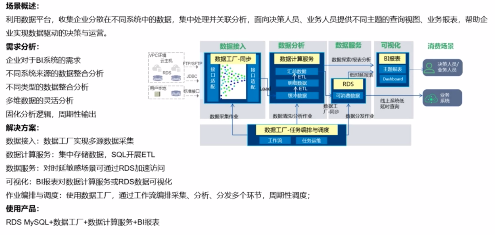

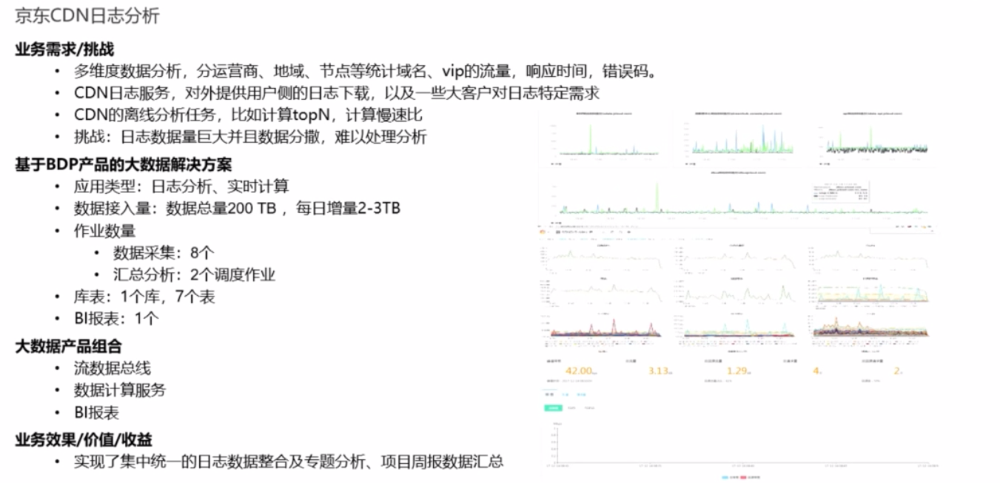

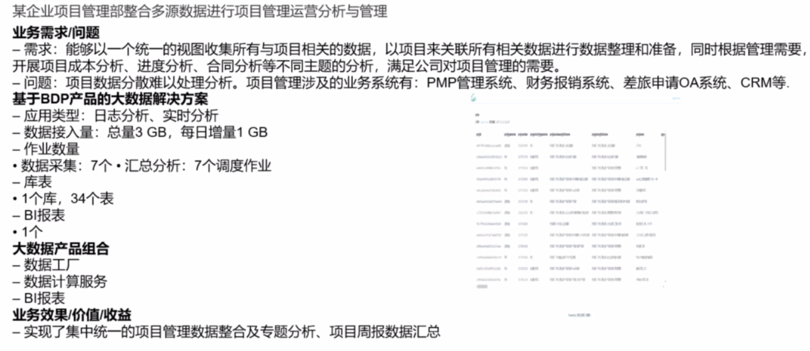

### 离线数据统计分析LAB

## 实时运营数据分析

分析处理流程

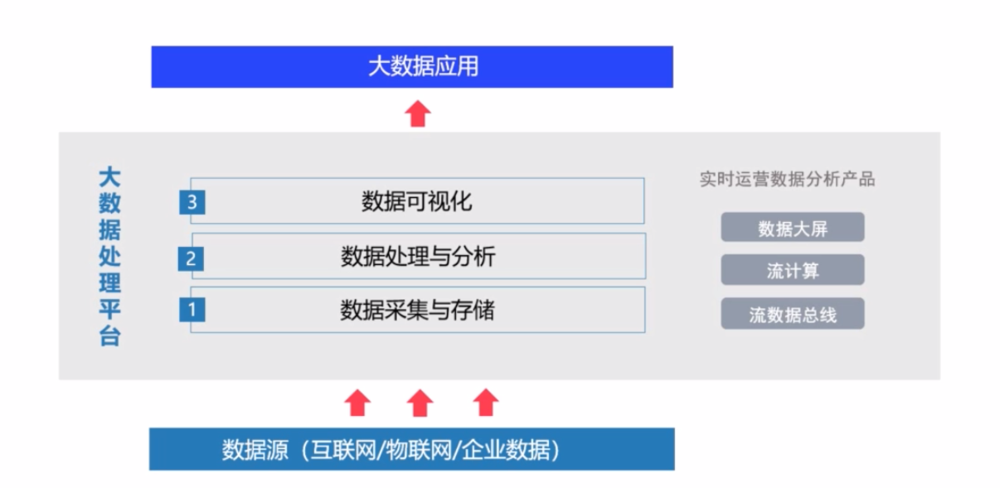

### 实时运营数据分析概念

大数据基础服务

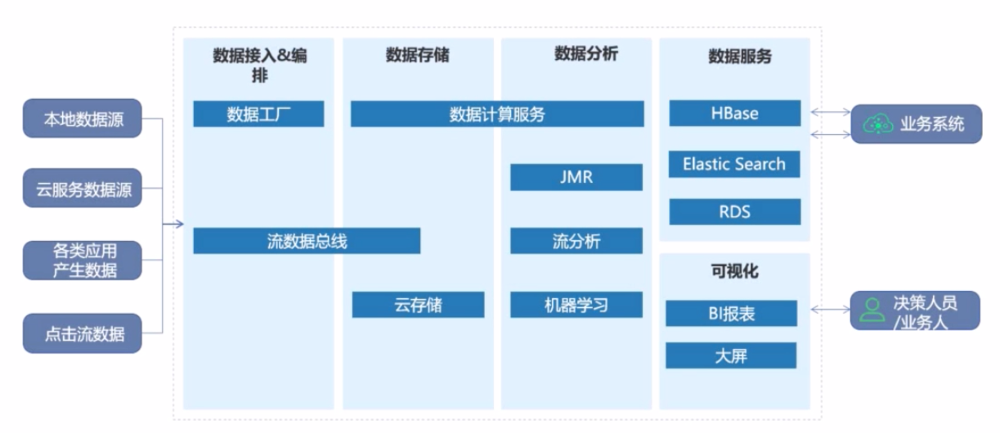

数据分析流程

### 流数据总线

**核心功能**

是面向大数据场景下可扩展、分布式、高吞吐量的消息服务，提供低延迟的消息发布及订阅功能，帮助用户低成本、快速构建可靠的实时分析应用

- 动态伸缩： 通过shard数量增减快速调整数据流吞吐能力
- 便捷接入： 提供 SDK/Agent等接入数据手段
- 无缝集成：与流计算服务无缝集成，用户可快速消费流数据开展实时分析
- 数据归档：提供低延时的数据归档能力，自动存储流式数据到对象存储和数据计算服务

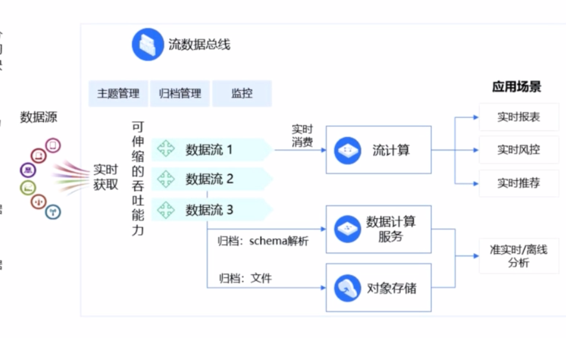

**流数据总线的使用**

流数据总线能够每秒接受和处理数百万级消息，可以存储和处理分布式软件和设备发送到流数据总线的数据，由于能够较低延迟和极高规模的提供发布订阅功能，流数据总线可以充当大数据的数据服务入口，收集在流数据总线中的数据可被下游服务应用进行消费使用，如被流计算产品进行实时数据处理，同时存储在流数据总线中的数据可存储到京东智联云存储、数据仓库等产品对数据进行持久化存储，以供未来分析使用。

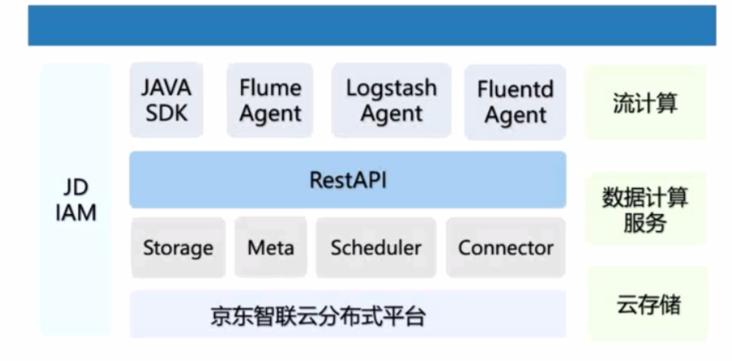

1. 创建主题
   - shard数据的处理能力：1个shard对应1MB/s或1000条数据写入，2MB/s数据读取
   - 生命周期：数据可以在流数据总线中存储1-7天
2. 数据归档
  如果需要将数据永久保存下来，需要开启归档功能
3. 数据监控
4. 访问控制：查看密钥

### 流计算

**概念**
流计算是大数据场景下的实时数据处理与分析平台，支持用户以SQL方式编写数据处理作业，降低流式数据开发门槛，帮助用户快速构建流处理应用
- 易于使用：实时数据清洗、统计汇总、数据分析，提供交互式SQL编辑器，可快速构建复杂的流处理应用程序。
- 实时处理：支持开展实时聚合计算、复杂时间处理等典型实时计算场景
- 自动集成：深度集成流数据中心和数据计算服务等云服务
- 弹性伸缩：自定义作业，计算集群弹性伸缩

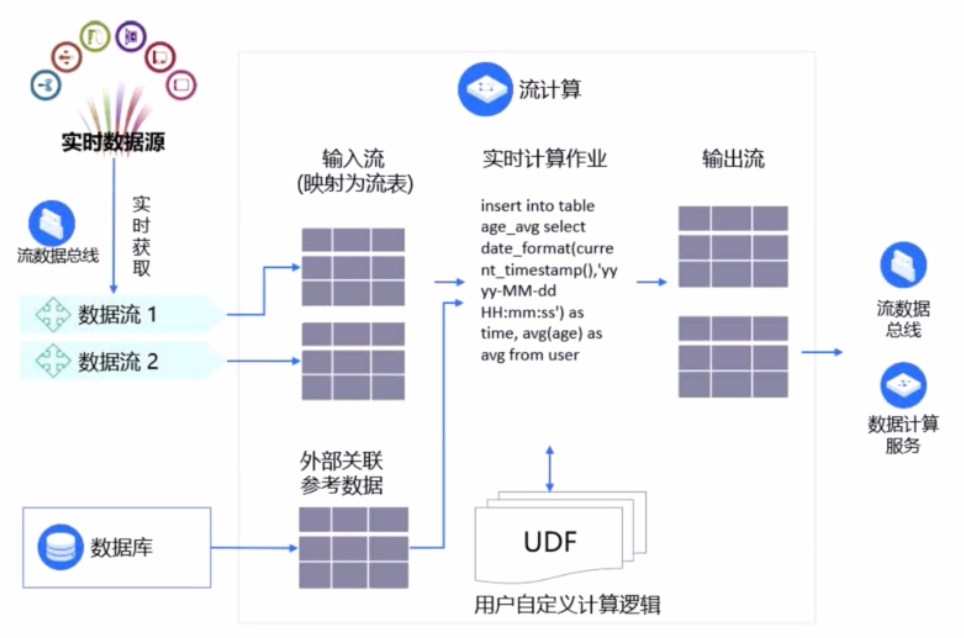

核心功能：
- 弹性伸缩
- 易于集成
- 完全托管的流计算服务
- 易用性和用户体验：提供全流程的流式数据处理方案，包括数据开发、监控和预警等不同阶段辅助套件，系统主要功能均提供可视化界面维护，界面操作友好，功能清晰，让数据开发仅需三步，即可完成流式计算作业上线。

1. 创建应用
  - 流式计算单元：是可使用的计算单元最高上限。一个单元包含1个cpu和4G内存
2. 数据输入
3. 数据输出
4. 作业开发：配置查询与任务

### 数据大屏

**概念**

- 数据接入方式：支持rds云数据库，本地关系型数据库、在线api、json文件及数据计算服务等多种数据源。
- 部署方案：支持公有云和私有云独立部署
- 图表库、模版库：
  - 46个组件：统计图表类、2d/3d/gis地图、文本类、辅助装饰、视频、交互
  - 17个模版：包括数据治理、农业监测、水质监测、工业及政务等
- 高级个性化定制图表样式：通过开放图表样式编辑器，可以实现一个组件多种个性化效果
- 支持移动端和pc端显示：采用svg + canvas双引擎数据渲染能力，支持手机和pc端展示

**版本计划**
- 3Dgis地图
  - 3D柱图、数据标签等
  - 城市白膜
- 专利组件： 具有特色的基础统计类组件
- 主子账号：主子账号、权限、计费高度个性化定制图表样式

**核心功能**
- 场景化模版：数据大屏模版综合运用了色彩搭配、组件布局、数据层次关联设计，并整合了多种行业和场景的实施案例为用户提供专业的特定行业特定场景通用解决方案
- 多种数据分析组件：提供折线图、柱状图、散点图、饼图、水位图、雷达图、k线图、箱线图、日历热力图、关系图、漏斗图、桑基图、仪表盘等多种图表，满足用户进行多维数据分析和展示。
- 丰富的数据源种类：支持json格式静态数据、rds云数据库、京东智联云数据计算服务及在线api方式，满足各类大数据实时计算、监控的需求，充分发挥大数据计算的能力。
- 快速图形化的搭建工作：无需编程能力，只要通过拖拽，即可创造出专业的可视化应用
- 多分辨率适配：针对拼接大屏端的展示做了分辨率优化，能够适配非常规的拼接分辨率。

**产品优势**
- 多数据源链接
- 丰富的图表库、模版库
- 移动端和pc端展示
- 人机交互：提供地图、Tab页签等人机交互组件，实现数据筛选。提供大屏控制台组件，支持多屏切换。
- 多部署方案

**我的数据大屏**
进入大屏
大屏画布
大屏预览与发布
数据源管理
图表组件
文本组件：通用标题、条形占比图跑马灯、时间器、翻牌器、倒计时、词云
### 实时运营数据分析场景案例
实时运营分析场景
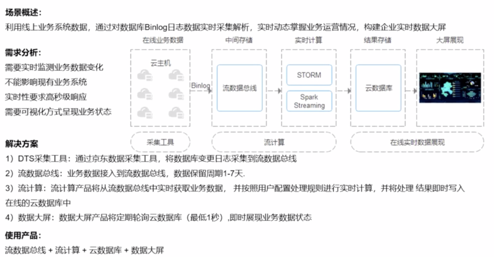

电商网站实时大屏展示
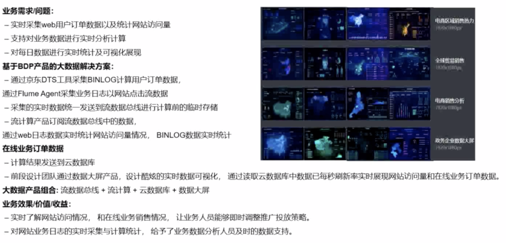

用户画像与个性推荐
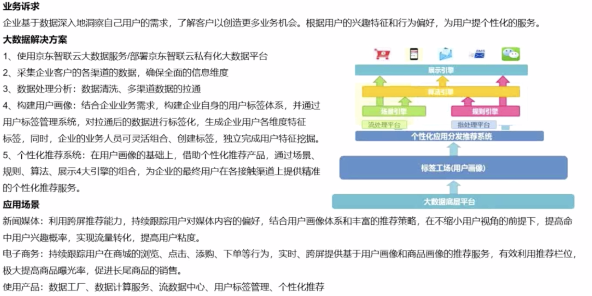

数据抓取文本分析
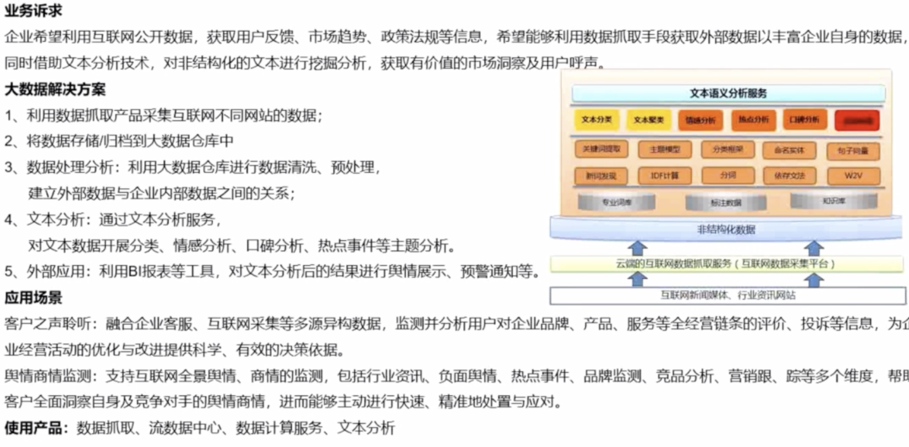

客户案例：
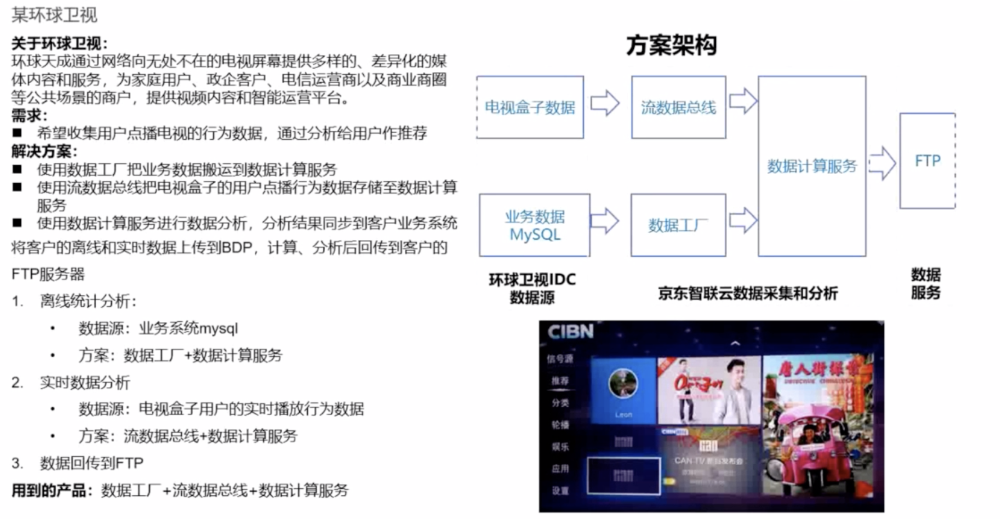

### 实时运营数据分析LAB

##弹性托管集群、服务扩展

###  1. JMR弹性托管集群概念
1. 创建集群
2. 参数配置
3. 创建作业
4. 设置定时任务调度

JMR弹性MapReduce，是一个托管集群平台，可以在京东智联云上运行大数据框架或运行这些框架相关的开源项目，可便捷的使用MapReduce、Hive、Spark、Presto等服务低成本开展大规模分布式数据计算服务和海量数据分析。
- 创建便捷：根据用户指定节点硬件配置、存储、软件、一键式自动创建集群，开启自动完成防火墙设置、弹性IP绑定。
- 灵活扩容
- 全面监控：提供集群的可用性、性能监控，帮助用户发现问题，解决问题，同时满足用户对集群资源调整、释放等管理需求。

### 2. JMR

**核心功能**
- 按需创建集群
- 系统监控
- 集群管理
- API/SDK接口

**产品优势**
- 简单易用
- 节约成本：可按需创建集群，也可选包年包月长期运行模式
- 深度整合相关产品
- 安全可靠：各JMR网络相互隔离

**使用流程**
1. 实名认证
2. 数据准备
3. 创建集群
4. 导入数据
5. 创建作业
6. 部署作业
7. 查看作业
8. 释放集群

操作控制：
创建集群
  软件与硬件设置
  网络与基本信息设置：建议打开所有网络端口
创建作业

### 3.JMR弹性托管集群场景案例
**使用场景**
- 日志处理分析
- 大规模ETL和数据迁移
- 即时查询
- 数据挖掘与分析
- 数据仓库
- 半结构/非结构化海量数据分析

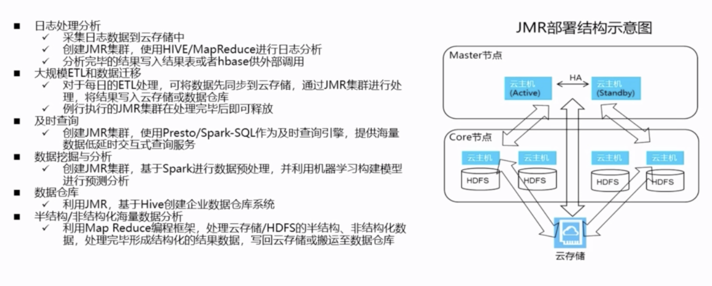

农业大数据平台
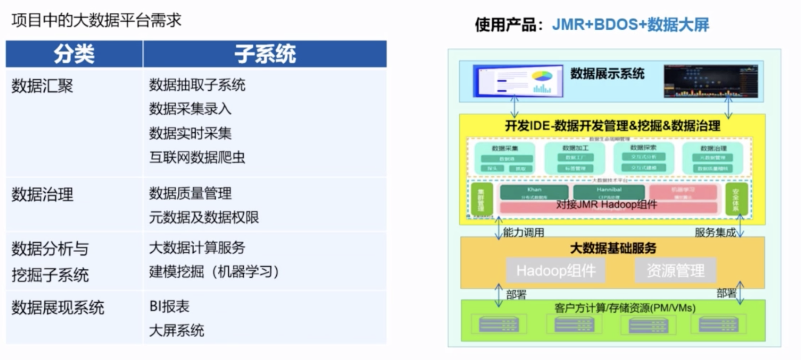

生鲜连锁
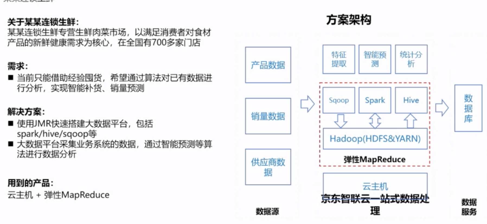

### 4. JMR弹性托管集群LAB

### 5. 机器学习

**概念**
机器学习是一类算法的总称，这些算法企图从大量的历史数据中挖掘出其中隐含的规律，用用于预测或者分类，更具体的说，机器学习可以看作是寻找一个函数，输入是样本数据，输出是期望的结果，只是这个函数过于复杂，以至于不太方便形式化表达。
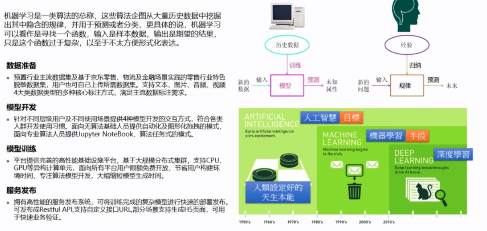

**流程**
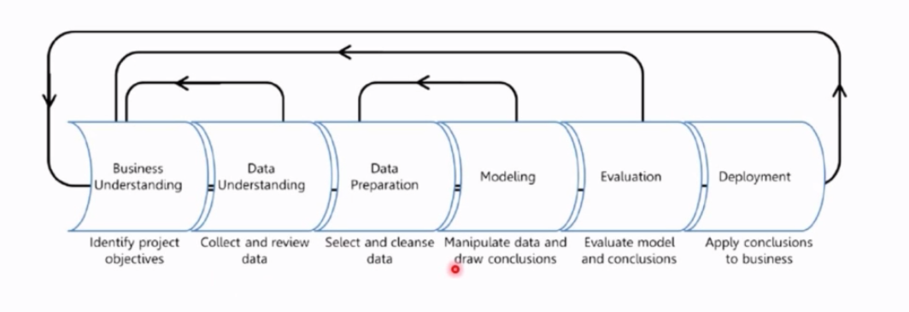

**模型训练**
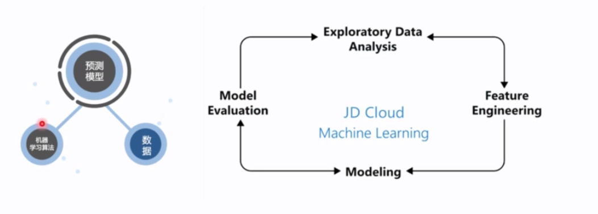

**机器学习服务**
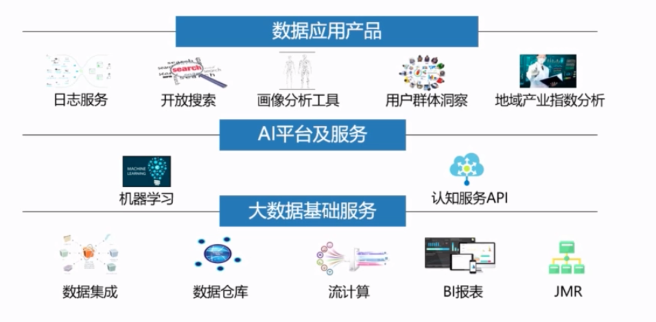

**机器学习平台**
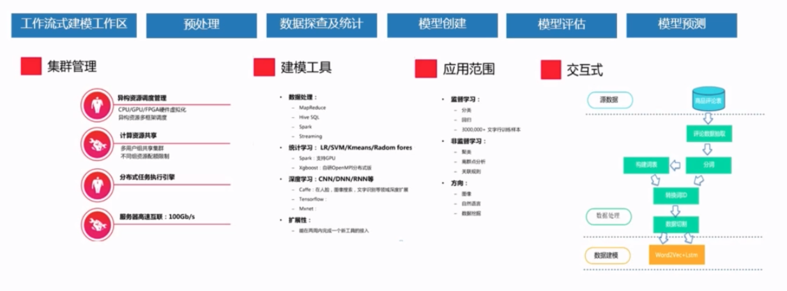

- 工作流式建模工作区
- 预处理
- 数据探查及统计
- 模型创建
- 模型评估
- 模型预测

其中
- 集群管理：
  - 异构资源调度管理
  - 计算资源共享
  - 分布式任务执行引擎
  - 服务器高速互联
- 建模工具：
  - 数据处理
  - 统计学习：LR/SVM/Kmeans/Random Front
  - 深度学习：CNN/DNN/RNN等
  - 扩展性
- 应用范围：
  - 监督学习：分类、回归
  - 非监督学习：聚类、离群点分析
  - 方向：图像、自然语言数据挖掘

**认知服务**
基于京东智联云GPU前向平台，部署认知服务模型，以Rest Api形式对外提供人工智能服务
- 人脸识别Api
- 食品检测
- 情绪识别
- OCR文字识别
- 图像分类
- 鉴黄鉴政
- 价签识别

**NeuFoundry**
基于京东丰富场景的最佳实践，为企业提供一站式AI开发平台。“私有化AI能力铸造厂”。以帮助企业用户快速低成本地构建自己的智能中台，完成智能化的升级转型。JDAI NeuFoundry 覆盖从数据标注-模型开发-模型训练-服务发布-生态市场的人工智能开发全生命周期，并预置高净值的脱敏数据、经实战验证的成熟模型以及典型项目场景，同时提供多种安全、灵活可定制的部署及交付方案。

- 零门槛入门，快速上手
- 一站式开发平台，全面覆盖
- 双引擎双智能，高效支撑
- 三类预置资源，加速开发

**应用场景**
产业园区与供应链
金融与制造

### 6. 区块链数据服务

京东智联云将区块链的链式、非结构化数据通过技术手段进行结构化存储，实时同步到高性能数据仓库中，并提供了一款数据可视化BI工具，实现简单的条件查询和复杂的SQL查询。
**数据查询和可视化**
- 通过点击和拖拽的交互方式挺假过滤条件进行数据查询
- 编写SQL语句进行复杂的数据查询
- 针对各类图表可进行高自由度的内容编辑，包括添加文字注释，改变图表颜色，以及显示趋势线等功能。

**查询结果存储和展示**
- 所有的查询记录都会被自动保存到历史问题中
- 可在个人集合中创建子集合，对查询的问题进行分类，整理和保存
- 将数据可视化结果展示在一个可进行自由布置的仪表盘，方便进行数据的对比和分析

**产品优势**
- 丰富性：涵盖了BTC、ETH、LTC、XRPBCH等几十个知名区块链项目，自定义了涉及用户、交易、区块等100+独家数据指标，联网即可查询链上实时数据，即开即用
- 便捷性：提供了一个交互式的数据可视化BI工具，支持通过点击和拖拽的交互方式进行条件查询，可实时生成各类数据报表、图形化界面。
- 专业性：支持标准SQL查询语句，可轻松实现复杂的查询逻辑
- 独家性：国内首家提供区块链上数据查询的产品，并提供了数据可视化BI工具

**区块链的特性**
1. 跨平台
2. 去中心化
3. 不可篡改
4. 分布式账本
5. 共识信任机制
6. 开放性
7. 匿名性

**区块链数据平台**
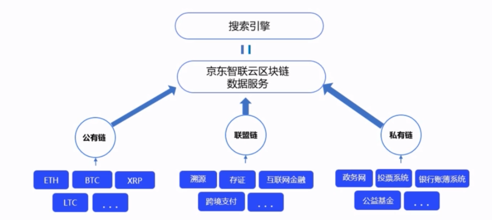

**BDS产品架构图**

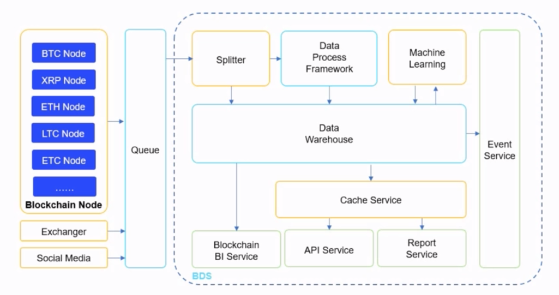

**应用场景**
数字监管
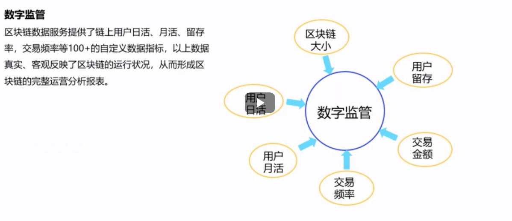

金融决策
通过区块链数据服务实时监控数字货币交易情况，实时了解行情动态，结合区块链相关的金融资讯、社会舆情、给金融决策，项目分析提供有效数据支撑。

犯罪证据
数字货币由于其地址匿名性往往被不法分子用于违法犯罪活动，区块链数据服务中完整记录了交易信息，通过分析地之间的交易行为，定位资金流向，获取金融犯罪的有效证据。

